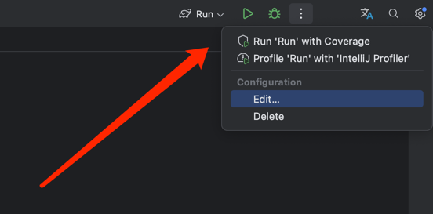
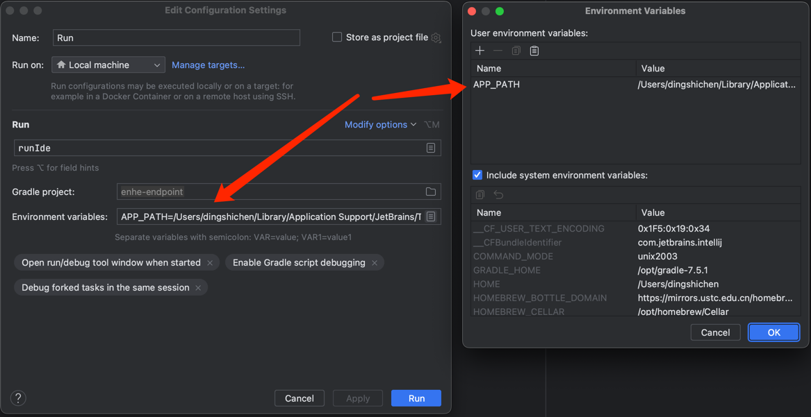

## Enhe Endpoint

> Adapts the Enhe Framework RestFull endpoint definition to provide a toolbar window to display the project controller tree. Supports navigation for event publishing and listening. And a highly customized code generator.

[-> Plugin Home](https://plugins.jetbrains.com/plugin/20660-enhe-endpoint)

### Required
- Code JDK 11
- Build JDK 17
- Gradle 7.5.1

### Target
- IntelliJ IDEA 212+

### Run
1. Gradle `RunIde` Add Environment variable `APP_PATH={Your IDEA path}`

### Thanks
[Special thanks to JetBrains for their support](https://jb.gg/OpenSourceSupport)

